# I. Overview
Provides an AI-powered mock interview platform, where candidates can:
- Answer interview questions via chat or voice.
- Receive a personalized set of questions based on their CV and current abilities.
- The AI interviewer generates questions, analyzes answers, and selects follow-up questions using context, a vector database, and skill data.
- At the end of the interview, the AI interviewer evaluates and provides detailed feedback.

| #      | Component                                               | Main Role & Description                                                                                                                                                                           | Suggested Technology                                |
| ------ | ------------------------------------------------------- | ------------------------------------------------------------------------------------------------------------------------------------------------------------------------------------------------- | --------------------------------------------------- |
| **1**  | **AI Interviewer Engine**                               | Core logic controller of the interview: generates questions, analyzes answers, selects follow-up questions based on context and vector DB.                                                        | Python + OpenAI API / LangChain / Hugging Face      |
| **2**  | **📄 CV Analyzer Component (Pre-Interview Preparation)**| Analyzes candidate’s CV to prepare questions:  • Extracts skills and experience. • Generates CV embeddings to select suitable opening questions. • Suggests topics for evaluation.       | Python / LangChain / spaCy / OpenAI Embeddings      |
| **3**  | **Question Bank**                              | Stores interview questions (technical, behavioral, situational). Supports tagging, versioning, and model fine-tuning.                                       | Python + PostgreSQL                                 |
| **4**  | **Vector Database**                                    | Stores embeddings for questions, skills, topics, and answers; supports semantic search to select next questions or assess ability.                          | Pinecone                                            |
| **5**  | **Chat UI / Frontend**                                 | Real-time chat interface between candidate and AI; supports text, voice chat, and displaying assessment results.                                                 | React + WebSocket / REST                            |
| **6**  | **🎤 Voice Answer Component (Speech-to-Text)**          | Allows candidates to answer by voice:  • Records & transcribes speech. • Supports multiple languages (EN, VI). • Sends transcript to AI Interviewer Engine.                             | Azure Speech-to-Text API                            |
| **7**  | **🗣️ AI Voice Response Component (Text-to-Speech)**    | Allows AI interviewer to respond or ask by voice:  • Converts text to natural audio. • Supports choice of voices & languages. • Plays audio to candidate in real-time.                  | Edge TTS (Microsoft Text-to-Speech)                 |
| **8**  | **Analytics & Feedback Service**                       | Collects answer data, evaluates abilities, summarizes feedback & generates end-of-interview reports.                                                        | LangChain + OpenAI GPT-4 / Claude / Llama 3 for analysis & feedback generation. scikit-learn / spaCy for linguistic & sentiment analysis.             |

# II. Main flows
## 1. Preparation Phase (Scan CV & Generate Topics)

```mermaid
sequenceDiagram
    actor Candidate
    participant ChatUI as Chat UI / Frontend
    participant CVAnalyzer as 📄 CV Analyzer Component
    participant VectorDB as 🧠 Vector Database
    participant AIEngine as 🤖 AI Interviewer Engine

    Candidate->>ChatUI: Upload CV file
    ChatUI->>CVAnalyzer: Send CV for analysis
    CVAnalyzer->>VectorDB: Generate & store CV embeddings
    VectorDB-->>CVAnalyzer: Confirm embeddings stored
    CVAnalyzer-->>ChatUI: Return extracted skills & suggested topics
    ChatUI-->>Candidate: Display preparation summary
    ChatUI->>AIEngine: Notify readiness (skills, topics)
    AIEngine-->>ChatUI: Acknowledged
```

## 2. Interview Phase (Real-time Q&A)

```mermaid
sequenceDiagram
    actor Candidate
    participant ChatUI as Chat UI / Frontend
    participant AIEngine as 🤖 AI Interviewer Engine
    participant VectorDB as 🧠 Vector Database
    participant QBank as 📚 Question Bank Service
    participant STT as 🎤 Speech-to-Text
    participant TTS as 🗣️ Text-to-Speech
    participant Analytics as 📊 Analytics & Feedback Service

    %% --- Start Interview ---
    Candidate->>ChatUI: Start interview
    ChatUI->>AIEngine: Request first question
    AIEngine->>VectorDB: Query similar question embeddings (based on CV topics)
    VectorDB-->>AIEngine: Return question candidates
    AIEngine->>QBank: Fetch selected question
    QBank-->>AIEngine: Return question details
    AIEngine-->>ChatUI: Send question text
    ChatUI-->>TTS: Convert question text to speech
    TTS-->>Candidate: Play AI voice question

    %% --- Candidate answers ---
    Candidate->>STT: Speak answer
    STT-->>AIEngine: Send transcript text
    AIEngine->>VectorDB: Compare answer embeddings & evaluate quality
    VectorDB-->>AIEngine: Return similarity & semantic score
    AIEngine->>Analytics: Send answer evaluation (score, sentiment, reasoning)
    Analytics-->>AIEngine: Acknowledged

    alt More questions remain
        AIEngine->>VectorDB: Retrieve next suitable question
        VectorDB-->>AIEngine: Return next question candidate
        AIEngine-->>ChatUI: Send next question
        ChatUI-->>TTS: Convert to speech & play
        TTS-->>Candidate: Play next question
    else Interview finished
        AIEngine-->>ChatUI: Notify interview end
    end

```

## 3. Final Stage (Evaluation & Reporting)

```mermaid
sequenceDiagram
    actor Candidate
    participant ChatUI as Chat UI / Frontend
    participant AIEngine as 🤖 AI Interviewer Engine
    participant Analytics as 📊 Analytics & Feedback Service

    AIEngine->>Analytics: Send final interview summary (scores, metrics, transcript)
    Analytics->>Analytics: Aggregate results & generate report
    Analytics-->>AIEngine: Acknowledged

    AIEngine-->>ChatUI: Notify interview completion
    ChatUI->>Analytics: Request final feedback report
    Analytics-->>ChatUI: Return detailed feedback & improvement suggestions
    ChatUI-->>Candidate: Display performance summary & insights

```

## III. Project Components

### 1. AI Interviewer Engine
**Core Features & Abilities:**
- **Question Generation**: Dynamically generates personalized interview questions based on candidate's CV analysis and current interview context
- **Answer Analysis**: Evaluates candidate responses using semantic analysis and contextual understanding
- **Follow-up Question Selection**: Intelligently selects next questions based on previous answers, skill gaps, and interview progression
- **Context Management**: Maintains conversation context throughout the interview session
- **Interview Flow Control**: Manages interview timing, question sequencing, and session state transitions
- **Real-time Decision Making**: Adapts interview strategy based on candidate performance and responses

**Tech Stack:**
- **Core Framework**: Python with LangChain for orchestration
- **AI Models**: OpenAI GPT-4/3.5-turbo for natural language processing
- **Alternative Models**: Hugging Face Transformers for specialized tasks
- **Integration**: RESTful APIs and WebSocket connections for real-time communication

### 2. 📄 CV Analyzer Component (Pre-Interview Preparation)
**Core Features & Abilities:**
- **Document Processing**: Extracts text from various CV formats (PDF, DOC, DOCX)
- **Skill Extraction**: Identifies technical skills, soft skills, and experience levels using NLP
- **Experience Analysis**: Parses work history, education, and project details
- **Embedding Generation**: Creates vector embeddings for CV content using OpenAI Embeddings
- **Topic Suggestion**: Recommends interview topics based on candidate's background
- **Skill Gap Analysis**: Identifies areas for evaluation and potential weaknesses

**Tech Stack:**
- **Core Language**: Python
- **NLP Processing**: spaCy for text processing and entity recognition
- **AI Integration**: LangChain for workflow orchestration
- **Embeddings**: OpenAI Embeddings API for vector generation
- **Document Processing**: PyPDF2, python-docx for file parsing

### 3. Question Bank
**Core Features & Abilities:**
- **Question Storage**: Centralized repository for technical, behavioral, and situational questions
- **Categorization**: Organizes questions by skill level, domain, and question type
- **Versioning**: Tracks question updates and maintains historical versions
- **Tagging System**: Supports metadata tagging for efficient question retrieval
- **Model Fine-tuning**: Enables custom question generation based on stored patterns
- **Quality Control**: Implements question validation and quality scoring

**Tech Stack:**
- **Database**: PostgreSQL for relational data storage
- **Backend**: Python with SQLAlchemy ORM
- **API Layer**: FastAPI or Flask for RESTful endpoints
- **Data Validation**: Pydantic for data models and validation

### 4. Vector Database
**Core Features & Abilities:**
- **Semantic Search**: Enables similarity-based question and answer retrieval
- **Embedding Storage**: Stores vector representations of questions, skills, topics, and answers
- **Contextual Matching**: Finds relevant questions based on candidate's CV embeddings
- **Answer Evaluation**: Compares candidate responses against reference answers
- **Dynamic Querying**: Supports real-time semantic search during interviews
- **Scalability**: Handles large-scale vector operations efficiently

**Tech Stack:**
- **Primary Database**: Pinecone for vector storage and similarity search
- **Alternative Options**: Weaviate, Chroma, or FAISS for local deployments
- **Integration**: Python SDKs for database operations
- **API Layer**: RESTful interfaces for vector operations

### 5. Chat UI / Frontend
**Core Features & Abilities:**
- **Real-time Chat Interface**: Provides seamless text-based communication between candidate and AI
- **Voice Integration**: Supports both text and voice input/output modes
- **Assessment Display**: Shows real-time feedback, scores, and progress indicators
- **Session Management**: Handles interview state, timing, and navigation
- **Responsive Design**: Works across desktop and mobile devices
- **Accessibility**: Supports screen readers and keyboard navigation

**Tech Stack:**
- **Frontend Framework**: React with TypeScript for type safety
- **Real-time Communication**: WebSocket for live chat functionality
- **HTTP Client**: Axios for REST API calls
- **UI Components**: Material-UI or Ant Design for consistent interface
- **State Management**: Redux Toolkit or Zustand for application state

### 6. 🎤 Voice Answer Component (Speech-to-Text)
**Core Features & Abilities:**
- **Audio Recording**: Captures candidate voice input with noise reduction
- **Speech Transcription**: Converts spoken responses to text with high accuracy
- **Multi-language Support**: Handles English and Vietnamese languages
- **Real-time Processing**: Provides live transcription feedback
- **Error Handling**: Manages audio quality issues and transcription errors
- **Integration**: Seamlessly sends transcripts to AI Interviewer Engine

**Tech Stack:**
- **Primary Service**: Azure Speech-to-Text API for cloud-based transcription
- **Alternative Options**: Google Speech-to-Text or AWS Transcribe
- **Audio Processing**: Web Audio API for browser-based recording
- **Language Support**: Multiple language models and accents

### 7. 🗣️ AI Voice Response Component (Text-to-Speech)
**Core Features & Abilities:**
- **Natural Voice Generation**: Converts AI text responses to human-like speech
- **Voice Selection**: Offers multiple voice options and personalities
- **Multi-language Support**: Supports English and Vietnamese voice output
- **Real-time Audio**: Streams audio responses to candidates immediately
- **Voice Customization**: Allows adjustment of speech rate, pitch, and tone
- **Audio Quality**: Delivers high-quality, clear audio output

**Tech Stack:**
- **Primary Service**: Edge TTS (Microsoft Text-to-Speech) for natural voice generation
- **Alternative Options**: Google Text-to-Speech or Amazon Polly
- **Audio Streaming**: Web Audio API for browser-based playback
- **Voice Models**: Multiple neural voice models for different languages

### 8. Analytics & Feedback Service
**Core Features & Abilities:**
- **Answer Evaluation**: Analyzes candidate responses for content quality, relevance, and depth
- **Sentiment Analysis**: Assesses emotional tone and confidence in responses
- **Performance Metrics**: Tracks scores, timing, and improvement areas
- **Report Generation**: Creates comprehensive end-of-interview feedback reports
- **Improvement Suggestions**: Provides actionable recommendations for skill development
- **Historical Analysis**: Maintains performance history across multiple sessions

**Tech Stack:**
- **AI Analysis**: LangChain + OpenAI GPT-4/Claude/Llama 3 for advanced text analysis
- **Linguistic Analysis**: scikit-learn for statistical analysis and spaCy for NLP processing
- **Data Processing**: Pandas and NumPy for data manipulation
- **Report Generation**: Jinja2 templates for dynamic report creation
- **Storage**: Integration with PostgreSQL for analytics data persistence